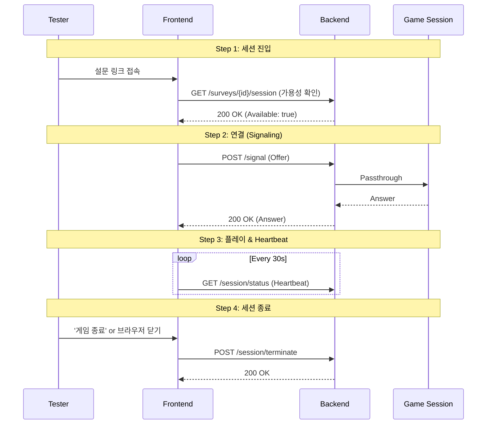

# Tester Session API

테스터(Respondent) 세션 관리 API - WebRTC 시그널링, Heartbeat, 대기열 관리

## Overview

설문 참여자가 링크를 타고 들어와서 게임을 플레이하는 과정을 관리합니다.



---

## 1. 세션 가용성 확인

**GET** `/surveys/{surveyUuid}/session`

현재 접속 가능한 슬롯이 있는지 확인하고 대기열 정보를 받습니다.

### Parameters

| Name         | In   | Type          | Description |
| :----------- | :--- | :------------ | :---------- |
| `surveyUuid` | path | string($uuid) | Survey UUID |

### Response

**200 OK**

```json
{
  "result": {
    "survey_uuid": "3fa85f64-5717-4562-b3fc-2c963f66afa6",
    "game_name": "My RPG",
    "is_available": true,
    "wait_time_seconds": 0,
    "queue_position": 0,
    "stream_settings": {
      "resolution": "1920x1080",
      "fps": 60
    }
  }
}
```

---

## 2. WebRTC 시그널링

**POST** `/surveys/{surveyUuid}/signal`

클라이언트와 GameLift 서버 간의 WebRTC 핸드셰이크를 중계합니다.

### Parameters

| Name         | In   | Type          | Description |
| :----------- | :--- | :------------ | :---------- |
| `surveyUuid` | path | string($uuid) | Survey UUID |

### Request Body

```json
{
  "signal_request": "SDP/ICE Candidate 문자열"
}
```

### Response

**200 OK**

```json
{
  "result": {
    "signal_response": "eyJzaWduYWxBbnN3ZXIiOiIuLi4ifQ==",
    "survey_session_uuid": "3fa85f64-5717-4562-b3fc-2c963f66afa6",
    "expires_in_seconds": 120
  }
}
```

---

## 3. 세션 상태 확인 (Heartbeat)

**GET** `/surveys/{surveyUuid}/session/status`

세션이 유효한지 주기적으로 확인합니다. 이 호출이 끊기면 서버는 유령 세션으로
간주하고 정리할 수 있습니다.

### Parameters

| Name                  | In    | Type          | Description         |
| :-------------------- | :---- | :------------ | :------------------ |
| `surveyUuid`          | path  | string($uuid) | Survey UUID         |
| `survey_session_uuid` | query | string($uuid) | Survey Session UUID |

### Response

**200 OK**

```json
{
  "result": {
    "is_active": true,
    "survey_session_uuid": "3fa85f64-5717-4562-b3fc-2c963f66afa6"
  }
}
```

---

## 4. 세션 종료

**POST** `/surveys/{surveyUuid}/session/terminate`

명시적으로 세션을 종료하고 슬롯을 반환합니다.

### Parameters

| Name         | In   | Type          | Description |
| :----------- | :--- | :------------ | :---------- |
| `surveyUuid` | path | string($uuid) | Survey UUID |

### Request Body

```json
{
  "survey_session_uuid": "3fa85f64-5717-4562-b3fc-2c963f66afa6",
  "reason": "USER_EXIT"
}
```

> **reason 값**: `USER_EXIT` | `TIMEOUT` | `ERROR`

### Response

**200 OK**

```json
{
  "result": {
    "success": true
  }
}
```

---

## Error Codes

| Code | Description                          |
| :--- | :----------------------------------- |
| S001 | 설문을 찾을 수 없습니다.             |
| T001 | 잘못된 Signal Request입니다.         |
| T002 | 리소스 미할당 또는 세션 불가         |
| T003 | GameLift 서비스 오류                 |
| T004 | 현재 접속 가능한 세션이 꽉 찼습니다. |
