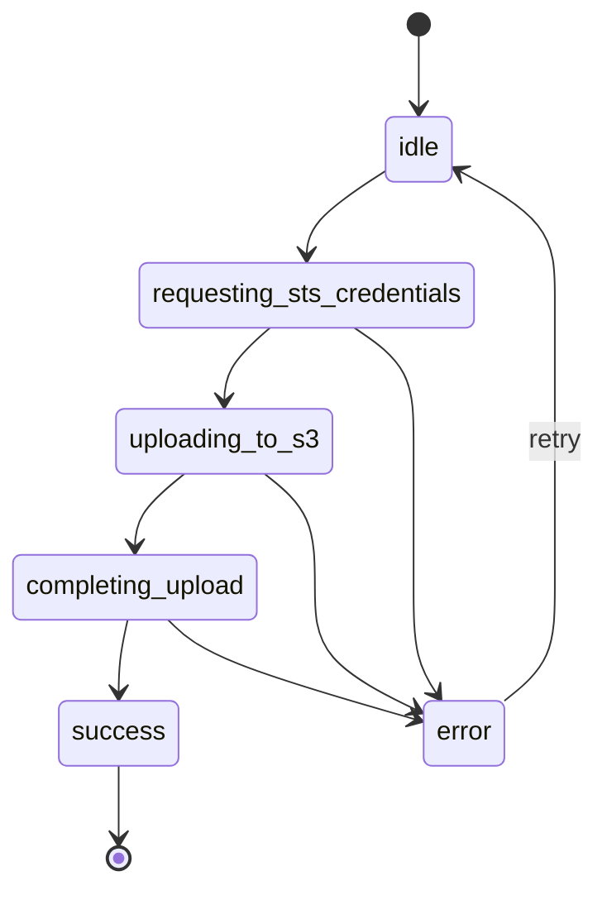

# Game Streaming - Phase 1 클라이언트 구현 가이드

> 클라우드 스트리밍 기반 게임 플레이테스트 플랫폼 - Creator Studio + Tester
> Phase 1 ~ 3 Implementation Guide

---

## 📋 제품/범위 요약 (Phase 1 MVP)

### A. Creator Studio (관리자 웹, Desktop only)

| 기능               | 상태               | 설명                                                 |
| ------------------ | ------------------ | ---------------------------------------------------- |
| Build 업로드       | ✅ 핵심            | STS 토큰 발급 → S3 폴더 업로드 → 완료 처리(complete) |
| Stream Settings UI | 🔧 필수 (API 없음) | GPU / 해상도·FPS / Capacity(max sessions) 설정 폼    |

### B. Tester Experience (Phase 2)

- WebRTC/Signaling 기반 스트리밍 플레이 구현
- `StartStreamSession`, `Signaling`, `Terminate` API 연동

---

## 🛠 기술 스택 및 규칙

- **Core**: React + TypeScript (Vite 기반)
- **Styling**: TailwindCSS
- **Routing**: React Router
- **Data Fetching**: React Query (TanStack Query)
- **State**: 최소화 (필요시 Zustand)
- **HTTP**: fetch 또는 axios (업로드 `onUploadProgress` 필요하면 axios 권장)
- **Target**: Desktop only, 기본 화면 폭 1280px

### 공통 UI 규칙

| 상태                    | UI 컴포넌트                                        |
| ----------------------- | -------------------------------------------------- |
| Loading / Empty / Error | 모든 페이지 필수                                   |
| 성공/실패 피드백        | `Toast`                                            |
| 폼 오류                 | `FieldError` / `InlineAlert`                       |
| 업로드 중               | `SpinnerOverlay` + `StepIndicator` + `ProgressBar` |
| 저장되지 않은 변경사항  | 탭 이동 시 `ConfirmDialog`                         |

---

## 🗺 라우팅 구조

```
/studio/games                           # Screen A: 게임 목록
/studio/games/:gameUuid/overview        # Screen B: 게임 개요 + 탭 쉘
/studio/games/:gameUuid/builds          # Screen C: 빌드 목록
/studio/games/:gameUuid/stream-settings # Screen E: 스트리밍 설정 (+ Capacity)
/play/:gameUuid                         # Screen G: 테스터 플레이 (placeholder)
```

---

## 📱 화면별 요구사항

### Screen A. Games 목록

- **Route**: `/studio/games`
- **목적**: gameUuid 선택 진입

#### 테이블 컬럼

| 컬럼         | 설명           |
| ------------ | -------------- |
| Game Name    | 게임 이름      |
| Game UUID    | 복사 버튼 포함 |
| Builds count | 없으면 "-"     |
| UpdatedAt    | 마지막 수정일  |

#### 동작

- Row click → `/studio/games/:uuid/overview`
- `Create Game` 버튼은 **API가 없으면 숨김**

#### 상태별 UI

| 상태    | UI                                        |
| ------- | ----------------------------------------- |
| Loading | skeleton 6 rows                           |
| Empty   | "등록된 게임이 없습니다"                  |
| Error   | "게임 목록을 불러오지 못했습니다" + Retry |

> **NOTE**: Games 목록 API가 없으면 mock 데이터로 대체 (구조는 실제처럼)

---

### Screen B. Game Shell + Tabs

- **Route**: `/studio/games/:gameUuid/*`

#### 레이아웃

- **상단**
  - Breadcrumb: `Games / {GameName}`
  - Title: `{GameName}`
  - Secondary: `UUID: {gameUuid}` + Copy 버튼
- **Tabs**: Overview | Builds | Stream Settings

#### 탭 이동 규칙

업로드/저장 중 이동 시 `ConfirmDialog`:

| 항목        | 내용                               |
| ----------- | ---------------------------------- |
| Title       | "변경사항이 저장되지 않았습니다"   |
| Description | "이동하면 현재 입력이 사라집니다." |
| Buttons     | 취소 / 이동                        |

---

### Screen C. Builds 탭 (리스트)

- **Route**: `/studio/games/:gameUuid/builds`

#### 페이지 구성

- **PageHeader**
  - Title: "Builds"
  - Subtitle: "게임 빌드 폴더를 업로드하고 상태를 확인합니다."
- **CTA**: Upload Build (모달 오픈)
- **Hint Box**: "ExecutablePath는 업로드 폴더 내 실행 파일의 상대 경로입니다.
  예) `{game uuid}/{build uuid}/{executable path}`"

#### 테이블 컬럼

| 컬럼        | 설명                                                        |
| ----------- | ----------------------------------------------------------- |
| Filename    | 파일명                                                      |
| StatusBadge | `PENDING` / `UPLOADED` / `REGISTERING` / `READY` / `FAILED` |
| Size        | 파일 크기                                                   |
| CreatedAt   | 생성일                                                      |
| Actions     | Copy S3Key, View details (옵션)                             |

#### 상태별 UI

| 상태  | UI                                        |
| ----- | ----------------------------------------- |
| Empty | "첫 빌드를 업로드하세요" + Upload Build   |
| Error | "빌드 목록을 불러오지 못했습니다" + Retry |

> **NOTE**: Builds 목록 API가 없으면 mock 처리 가능

---

### Screen D. Upload Build Modal (핵심)

- **Trigger**: Builds 탭의 "Upload Build"
- **Modal width**: 720px

#### 입력 Step (Idle)

| 필드           | 타입                      | 필수 | 설명                         |
| -------------- | ------------------------- | ---- | ---------------------------- |
| Build Folder   | Drag&Drop + Choose Folder | ✅   | 폴더 선택, 총 용량 최대 10GB |
| ExecutablePath | 텍스트 입력               | ✅   | 폴더 내 상대 경로            |
| Version        | 텍스트 입력               | ❌   |                              |
| Note           | 텍스트 입력               | ❌   |                              |

**버튼**: Cancel / Start Upload

#### 업로드 상태 머신



#### 에러 객체 구조

```ts
type UploadError = {
  step: 'sts' | 'upload' | 'complete';
  code?: string;
  message: string;
  retriable: boolean;
};
```

#### API 연동 (명세 확정)

> **참조**: `game_streaming_api.md` - Phase 1: 빌드 자산 관리 (S3)

##### 1. 빌드 생성 및 STS 임시 자격 증명 발급

```http
POST /games/{gameUuid}/builds

Request Body:
{ "version": "1.0.0" }

Response:
{
  "buildId": "uuid",
  "version": "1.0.0",
  "s3Prefix": "gameUuid/buildUuid/",
  "credentials": {
    "accessKeyId": "ASIA...",
    "secretAccessKey": "...",
    "sessionToken": "...",
    "expiration": 1704456000000
  }
}
```

##### 2. S3 폴더 업로드

```text
AWS SDK (PutObjectCommand) 사용

업로드 대상:
- 선택된 폴더 내 모든 파일을 재귀적으로 업로드
- 각 파일의 S3 Key: {s3Prefix}/{상대경로}

진행률 표시 필수:
- 전체 파일 수 / 완료된 파일 수
- 전체 bytes / 업로드된 bytes
- percent
- speed (대략)
- eta (대략)
- 현재 업로드 중인 파일명
```

##### 3. 완료 처리

```http
POST /games/{gameUuid}/builds/{buildId}/complete

Request Body:
{
  "expected_file_count": 150,
  "expected_total_size": 1073741824,
  "executable_path": "game.exe",
  "os_type": "WINDOWS"
}

Response:
{
  "result": {
    "id": "uuid",
    "status": "UPLOADED",
    "executable_path": "game.exe",
    "os_type": "WINDOWS"
  }
}
```

#### 실패 UX

| 실패 단계 | 조건           | 메시지                                       | 액션                     |
| --------- | -------------- | -------------------------------------------- | ------------------------ |
| STS       | 발급 실패      | "업로드 인증 정보 발급 실패"                 | Retry / Cancel           |
| Upload    | 네트워크       | "네트워크 문제로 업로드가 중단되었습니다."   | Retry / Restart / Cancel |
| Upload    | 자격증명 만료  | "업로드 인증이 만료되었습니다. 다시 시작..." | Restart (새 STS 발급)    |
| Upload    | AccessDenied   | "S3 접근 권한이 없습니다."                   | Restart / Cancel         |
| Upload    | 파일 읽기 실패 | "파일을 읽을 수 없습니다: {filename}"        | Skip / Retry / Cancel    |
| Complete  | G003           | "업로드된 파일을 찾을 수 없습니다"           | Restart                  |
| Complete  | G002           | "빌드 세션을 찾을 수 없습니다"               | Restart                  |
| Complete  | G004           | "S3 확인 중 오류가 발생했습니다"             | Retry / Cancel           |

#### 업로드 성공 후

- **Toast**: "업로드가 완료되었습니다."
- **Footer**:
  - Primary: "Go to Stream Settings"
  - Secondary: "Close"

#### 업로드 중 모달 닫기 정책

- X 버튼: disabled + tooltip
- Cancel 제공 + ConfirmDialog:
  - 메시지: "업로드를 취소할까요? 지금까지 전송된 데이터는 저장되지 않을 수
    있습니다."
  - Buttons: 계속 업로드 / 취소하고 닫기

---

### Screen E. Stream Settings 탭 (UI 중심, API 없음)

- **Route**: `/studio/games/:gameUuid/stream-settings`

#### Form 필드

| 필드            | 타입     | 옵션                             |
| --------------- | -------- | -------------------------------- |
| GPU Profile     | Select   | Entry / Performance / High       |
| Resolution/FPS  | Radio    | 720p30 / 1080p60 (권장)          |
| Capacity Target | Number   | 동시 세션 최대 수 (0 = 비활성화) |
| OS              | Readonly | Windows Server 2022              |
| Region          | Readonly | ap-northeast-1                   |

> **CHANGED**: Phase 2에서 `StreamingResource` 생성 시
> (`POST /surveys/{surveyId}/streaming-resource`) Instance Type과 Max Capacity를
> 설정하게 변경되었습니다. 이 화면의 설정값은 로컬 스토어에 보관했다가,
> 배포(Provisioning) 시점에 사용합니다.

#### 동작

- **성공 Toast**: "스트리밍 설정이 저장되었습니다."
- **실패 InlineAlert**: "저장에 실패했습니다. 다시 시도해주세요."

> **NOTE**: 저장/조회 API가 없으므로 임시로 local mock store
> (Zustand/localStorage)로 동작

---

### Screen G. Tester Placeholder

- **Route**: `/play/:gameUuid`

#### Requirements Check

- WebRTC 지원 여부
- **Active Session Check**: 진입 시 `GET /surveys/{surveyUuid}/session` 호출하여
  스트리밍 가능 여부(`is_available`) 확인

#### 동작

- `Start Streaming` 버튼:
  1. SDK 초기화
  2. `POST /surveys/{surveyUuid}/signal` 호출
  3. 연결 수립
- **Unsupported 문구**: "지원하지 않는 환경입니다. Chrome 최신버전/PC로
  접속하세요."

---

## 📡 추가 필요 API (명세 없음)

클라이언트 완전 동작을 위해 필요한 API 목록:

| API                  | Method | Endpoint                                            |
| -------------------- | ------ | --------------------------------------------------- |
| Builds 목록          | GET    | `/games/{gameUuid}/builds`                          |
| Build 상세 (선택)    | GET    | `/games/{gameUuid}/builds/{buildId}`                |
| Survey Resource 생성 | POST   | `/surveys/{surveyId}/streaming-resource`            |
| Test 시작            | POST   | `/surveys/{surveyId}/streaming-resource/start-test` |
| Test 종료            | POST   | `/surveys/{surveyId}/streaming-resource/stop-test`  |

---

## 🧩 컴포넌트 명세 (Phase 1 필수)

### Layout

- `AppShell` - TopBar, SidebarNav
- `GameShell` - Breadcrumb, Title, UUID Copy, Tabs, Outlet

### UI

- `DataTable` + `StatusBadge`
- `EmptyState`, `InlineAlert`, `Toast`
- `ConfirmDialog`

### Build Upload

- `BuildUploadModal` - props: `gameUuid`, `onSuccess(build)`
- `DragDropFolderInput` - 폴더 선택 (webkitdirectory)
- `FolderUploadProgress` - 파일 수/bytes/percent/speed/eta/현재파일

### Forms

- `GPUProfileSelect`
- `ResolutionFpsRadioGroup`
- `DateTimeRangePicker`
- `TimezoneSelect`
- `NumberInput`

---

## 📝 문구(카피) 고정

### Toast 성공

- "업로드가 완료되었습니다."
- "스트리밍 설정이 저장되었습니다."
- "스케줄이 저장되었습니다."

### 공통 실패

- "요청에 실패했습니다. 다시 시도해주세요."

---

## ✅ Acceptance Criteria

- [ ] 업로드 성공/실패 케이스별 UI 동작
- [ ] 페이지 Loading/Empty/Error 처리
- [ ] 탭 이동 ConfirmDialog 동작
- [ ] `.zip` / 용량 / ExecutablePath 검증 동작

---

## ☁️ Phase 2 & 3: Resource & Access Management

> **Note**: Survey 단위로 스트리밍 리소스를 할당하고 관리합니다.

### 1. Resource Provisioning (Phase 2)

- **Context**: 설문 배포 탭
- **Action**: "빌드 연결" (S3 Build -> GameLift Application / Stream Group)
- **API**: `POST /surveys/{surveyId}/streaming-resource`
  - `build_uuid`
  - `instance_type` (e.g. `gen4n_win2022`)
  - `max_capacity` (Service Capacity)
- **Status Lifecycle**: `PENDING` -> `PROVISIONING` -> `READY` (Cap=0)

### 2. Admin Test (Phase 3)

- **Context**: 설문 배포 탭 (Ready 상태일 때)
- **Test Start**: `POST .../start-test`
  - Capacity: 0 -> 1
  - Status: `TESTING`
- **Test Stop**: `POST .../stop-test`
  - Capacity: 1 -> 0
  - Status: `READY`

### 3. Service Open (Phase 4)

- **Context**: 설문 "개요" 탭 -> Status 변경
- **Action**: Survey Status `ACTIVE`로 변경
- **Logic**:
  - Survey Status -> `ACTIVE`
  - Resource Status -> `SCALING` (Backend triggers scaling to `max_capacity`)

---

## 🎮 Tester Experience 작업 태스크 (Phase 2)

> Amazon GameLift Streams Web SDK를 활용하여 Tester Experience 프론트엔드 구현

### Feature 1: GameLift Streams SDK 통합

#### SDK 초기화

- [ ] GameLift Streams Web SDK 설치 및 임포트
- [ ] `GameLiftStreams` 인스턴스 생성:
  - `videoElement`: HTML5 `<video>` 요소 바인딩
  - `inputConfiguration`:
    - `autoKeyboard: true`
    - `autoMouse: true`
    - `autoGamepad: true`
    - `autoCapture: true` (Pointer Lock for FPS)
    - `detachOnWindowBlur: true`
    - `resetOnDetach: true`

#### Signaling 플로우 (API 명세 반영)

1. **Session Check**: `GET /surveys/{surveyUuid}/session`
   - `is_available` 확인
   - `stream_settings` (resolution, fps) 정보 획득

2. **Signal Request**: `POST /surveys/{surveyUuid}/signal`
   - Client: SDK `generateSignalRequest()` -> Offer 생성
   - Server: GameLift `StartStreamSession` -> Answer 반환
   - Response: `signal_response`, `survey_session_uuid`

3. **Connection**:
   - Client: `completeConnection(signal_response)`

4. **Termination**: `POST /surveys/{surveyUuid}/session/terminate`
   - 페이지 이탈, 종료 버튼, 또는 에러 발생 시 호출

---

### Feature 2: Connection State UI

#### 상태별 화면

| 상태      | UI                                |
| --------- | --------------------------------- |
| 초기화 중 | SDK 로딩 스피너                   |
| 연결 중   | "스트림 연결 중..." + 프로그레스  |
| 연결 성공 | 비디오 플레이어 + 컨트롤 오버레이 |
| 연결 끊김 | 에러 메시지 + Reconnect 버튼      |
| 연결 실패 | 상세 에러 안내                    |

#### 컨트롤 오버레이

- [ ] Fullscreen 토글 버튼
- [ ] 음소거/해제 버튼 (Autoplay 정책 대응)
- [ ] 연결 품질 지표 표시 (선택)
- [ ] 종료/나가기 버튼

---

### Feature 3: UX 세부 처리

#### Autoplay 정책 대응

- [ ] 비디오 muted 상태로 자동 재생 시작
- [ ] "클릭하여 소리 켜기" 오버레이 표시
- [ ] 사용자 클릭 시 `video.muted = false`

#### Pointer Lock 해제 UX

- [ ] ESC 키로 Pointer Lock 해제 시 오버레이 표시
- [ ] "클릭하여 게임으로 돌아가기" 안내
- [ ] 클릭 시 Pointer Lock 재진입

#### Reconnect 로직

- [ ] 연결 끊김 감지 시 자동 재연결 시도 (최대 3회)
- [ ] 수동 Reconnect 버튼 제공

---

### Feature 4: 환경 대응

#### 브라우저 감지 및 차단

- [ ] WebRTC 지원 여부 체크
- [ ] 데스크톱/모바일 환경 감지
- [ ] 미지원 브라우저 Fallback 페이지:
  - Chrome/Edge 최신 버전 권장
  - PC 접속 권장 안내

---

### 컴포넌트

- [ ] `StreamPlayer` - SDK + Video + 오버레이 통합
- [ ] `ConnectionStatusOverlay` - 연결 상태별 UI
- [ ] `ControlOverlay` - Fullscreen, Mute 버튼
- [ ] `PointerLockPrompt` - ESC 해제 시 안내
- [ ] `UnsupportedBrowserPage` - Fallback 페이지

### Hooks

- [ ] `useGameLiftStream` - SDK 초기화 및 연결 관리
- [ ] `useConnectionState` - 연결 상태 관리
- [ ] `useBrowserSupport` - 환경 지원 여부 체크

---

## 💡 Tech Notes

1. **SDK 활용**: 입력 캡처, Data Channel, Pointer Lock 등은 SDK가 처리하므로
   직접 구현 불필요
2. **Backend 필수**: SignalRequest/Response 교환은 Backend를 경유해야 함 (보안상
   직접 호출 불가)
3. **Autoplay**: Chrome 정책상 muted 상태로 시작 필수
4. **Pointer Lock**: SDK의 `autoCapture` 옵션 사용, ESC 해제 시 UX만 처리
