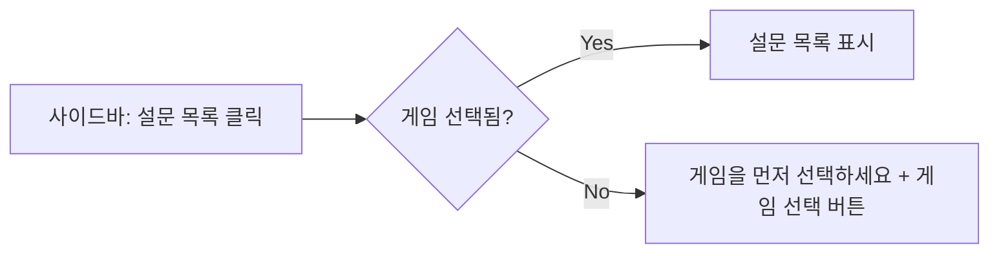
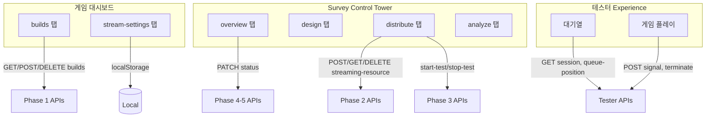

# 서비스 흐름도 UI 구현 계획

> **Last Updated**: 2026-01-06 **Status**: Planning

---

## 📋 개요

새 서비스 흐름도를 반영하여 네비게이션, 라우팅, 레이아웃 컴포넌트를
재구성합니다.

### 핵심 변경 사항

| 항목                         | 변경 내용                                       |
| ---------------------------- | ----------------------------------------------- |
| **사이드바 설정 메뉴**       | 제거 → 유저 카드 우측 상단 설정 아이콘으로 대체 |
| **유저 카드 클릭**           | 2탭 모달 (계정 설정 / 워크스페이스 관리)        |
| **Topbar WorkspaceSelector** | GameSelector로 완전 대체                        |
| **게임 선택 상태**           | URL 기반 (`/games/:gameUuid/*`)                 |
| **모바일/태블릿**            | Desktop 접속 안내 페이지 표시                   |

---

## 🎯 결정 사항

### 1. 게임 선택 상태 관리: URL 기반 (A)

**선택 근거:**

- URL이 곧 상태이므로 북마크/공유 가능
- React Router의 `useParams`로 간단히 접근
- 새로고침해도 상태 유지

**Zustand 대비 장점:**

- 추가 상태 관리 없음 (단순성)
- URL 변경 시 자동으로 컴포넌트 리렌더

**Zustand가 더 나은 경우 (참고용):**

- 여러 페이지에서 게임 정보를 캐싱해야 할 때
- URL 외에 추가 메타데이터(게임 이름, 상태 등)를 전역으로 관리해야 할 때
- → 현재 구조에서는 `useParams` + React Query 캐싱으로 충분

### 2. 대기열 순번 조회: Polling 기반

**구현 방식:**

```typescript
// 5초 간격 polling
const { data } = useQuery({
  queryKey: ['queue-position', surveyUuid],
  queryFn: () => getQueuePosition(surveyUuid),
  refetchInterval: 5000, // 5초
  enabled: isWaiting, // 대기 중일 때만
});
```

**필요한 API 추가:**

```http
GET /surveys/{surveyUuid}/queue-position

Response:
{
  "result": {
    "position": 3,           // 현재 대기 순번
    "estimated_wait": 120,   // 예상 대기 시간 (초)
    "total_waiting": 10      // 전체 대기 인원
  }
}
```

> ⚠️ **Note**: 이 API는 현재 `game_streaming_api.md`에 없음. 백엔드와 협의 필요.

### 3. Desktop Only: 안내 페이지 표시

**구현 위치:** `RootLayout.tsx` 또는 `App.tsx`

**로직:**

```typescript
const isMobileOrTablet = /Mobi|Android|iPad|Tablet/i.test(navigator.userAgent);

if (isMobileOrTablet) {
  return <DesktopOnlyPage />;
}
```

---

## 🎨 현재 vs 제안 비교

### 현재 구조

```
┌─────────────────────────────────────────────────────────────┐
│ Topbar                                                      │
│ [Breadcrumb]                    [🏢 워크스페이스 ▼][🔔]     │
├────────────┬────────────────────────────────────────────────┤
│ Sidebar    │ Main Content                                   │
│ ┌────────┐ │                                                │
│ │  Logo  │ │                                                │
│ ├────────┤ │                                                │
│ │ Nav    │ │                                                │
│ │ Items  │ │                                                │
│ ├────────┤ │                                                │
│ │ 설정   │ │ ← 사이드바 하단 설정 메뉴                      │
│ ├────────┤ │                                                │
│ │ User   │ │ ← 클릭 시 액션 없음 (단순 정보 표시)           │
│ │ Card   │ │                                                │
│ └────────┘ │                                                │
└────────────┴────────────────────────────────────────────────┘
```

### 제안 구조

```
┌─────────────────────────────────────────────────────────────┐
│ Topbar                                                      │
│ [Breadcrumb]                    [🎮 게임 선택 ▼][🔔]        │
├────────────┬────────────────────────────────────────────────┤
│ Sidebar    │ Main Content                                   │
│ ┌────────┐ │                                                │
│ │  Logo  │ │                                                │
│ ├────────┤ │                                                │
│ │ Nav    │ │                                                │
│ │ Items  │ │                                                │
│ ├────────┤ │                                                │
│ │ User[⚙]│ │ ← 우측 상단 설정 아이콘, 클릭 시 2탭 모달     │
│ │ Card   │ │                                                │
│ └────────┘ │                                                │
└────────────┴────────────────────────────────────────────────┘
```

---

## 🏗️ 아키텍처 변경

### 사이드바 유저 카드

**Before:**

```
┌──────────────────────────────┐
│ [Avatar]  홍길동              │
│           gildong@email.com  │
│ ┌──────────────────────────┐ │
│ │ 🏢 워크스페이스 | Admin   │ │
│ └──────────────────────────┘ │
└──────────────────────────────┘
```

**After:**

```
┌──────────────────────────────┐
│ [Avatar]  홍길동         [⚙️]│ ← 설정 아이콘 추가
│           gildong@email.com  │
│ ┌──────────────────────────┐ │
│ │ 🏢 워크스페이스 | Admin   │ │
│ └──────────────────────────┘ │
└──────────────────────────────┘
```

### 설정 모달 (2탭 구조)

```
┌─────────────────────────────────────────────────────┐
│ ⚙️ 설정                                         [X]│
├──────────────┬──────────────────────────────────────┤
│              │                                      │
│ [👤 계정]    │  계정 정보                          │
│              │  ┌────────────────────────────────┐  │
│ [🏢 워크     │  │ [Avatar] 홍길동                │  │
│   스페이스]  │  │         gildong@email.com      │  │
│              │  └────────────────────────────────┘  │
│              │                                      │
│              │  이메일 변경                         │
│              │  [                          ] [변경] │
│              │                                      │
│              │  비밀번호 변경                       │
│              │  [비밀번호 변경하기]                 │
│              │                                      │
│              │  ────────────────────                │
│              │  [로그아웃]                          │
│              │                                      │
└──────────────┴──────────────────────────────────────┘
```

### Navigation 변경

**Before:**

```typescript
NAV_ITEMS = [
  { to: '/dashboard', label: '대시보드' },
  // ...
];

SECONDARY_NAV_ITEMS = [
  {
    to: '/settings',
    label: '설정',
    children: [{ to: '/settings/account', label: '계정 설정' }],
  },
];
```

**After:**

```typescript
NAV_ITEMS = [
  { to: '/', label: '워크스페이스' },
  { to: '/studio', label: 'Creator Studio', ... },
  { to: '/games', label: '내 게임', ... },
  { to: '/survey', label: '설문 관리', ... },
  { to: '/rewards', label: '리워드 관리', ... },
];

// SECONDARY_NAV_ITEMS 제거 (설정 메뉴 없음)
```

---

## 🔍 UX/UI 흐름 분석

### ✅ 잘 된 점

1. **명확한 계층 구조**: 워크스페이스 → 게임 → 설문 흐름이 논리적
2. **상태 기반 UI 잠금**: 설문 상태(DRAFT/ACTIVE/CLOSED)에 따른 편집 제한이 명확
3. **점진적 공개**: 복잡한 기능을 탭으로 분리하여 인지 부하 감소

### ⚠️ UX 문제점 및 해결책

#### 문제 1: 게임 선택 없이 설문 목록 접근 가능?

| 문제                                                                 | 해결책                                                                      |
| -------------------------------------------------------------------- | --------------------------------------------------------------------------- |
| 설문이 게임에 종속되면, 게임 미선택 시 설문 메뉴가 비활성화되어야 함 | **Empty State 또는 Redirect**: 게임 미선택 시 "먼저 게임을 선택하세요" 안내 |



#### 문제 2: 게임 선택 후 Breadcrumb 동기화

| 문제                                                                | 해결책                                            |
| ------------------------------------------------------------------- | ------------------------------------------------- |
| Topbar에서 게임 변경 시 Breadcrumb와 현재 페이지가 불일치할 수 있음 | 게임 변경 시 해당 게임의 Overview로 **강제 이동** |

#### 문제 3: 설문 상태 변경 시 확인 흐름

| 문제                                                                       | 해결책                                      |
| -------------------------------------------------------------------------- | ------------------------------------------- |
| DRAFT → ACTIVE 전환 시 설문 잠금의 중요성을 사용자가 인지하지 못할 수 있음 | **Warning Modal** 필수 표시 + 체크박스 확인 |

```
┌────────────────────────────────────────────────┐
│ ⚠️ 설문을 시작하시겠습니까?                    │
├────────────────────────────────────────────────┤
│                                                │
│ 설문이 시작되면:                               │
│ • 문항 수정이 불가능합니다                     │
│ • 테스터에게 링크가 공개됩니다                 │
│ • 인스턴스 비용이 발생할 수 있습니다           │
│                                                │
│ ☐ 위 내용을 확인했습니다                       │
│                                                │
│ [취소]                     [설문 시작]        │
└────────────────────────────────────────────────┘
```

#### 문제 4: 테스터 대기열 UX

| 문제                                                      | 해결책                                                     |
| --------------------------------------------------------- | ---------------------------------------------------------- |
| Capacity 초과 시 테스터가 언제까지 기다려야 하는지 불분명 | Polling(5초)으로 **대기열 순번** + **예상 대기 시간** 표시 |

#### 문제 5: 빌드 연결 전 배포 탭 접근

| 문제                                             | 해결책                                              |
| ------------------------------------------------ | --------------------------------------------------- |
| 빌드가 연결되지 않은 상태에서 배포 탭이 활성화됨 | **단계별 가이드** 표시: "1. 빌드를 먼저 연결하세요" |

#### 문제 6: 모바일/태블릿 대응

| 문제                                                           | 해결책                                         |
| -------------------------------------------------------------- | ---------------------------------------------- |
| Desktop Only 명시되어 있지만, 관리자가 모바일로 접근할 수 있음 | **DesktopOnlyPage** 표시하여 Desktop 접속 안내 |

---

## 📡 API 통합 계획

### 현재 API 명세 분석

| Phase         | API                                                  | 현재 페이지 연결 상태          |
| ------------- | ---------------------------------------------------- | ------------------------------ |
| **Phase 1**   | `GET /games/{gameUuid}/builds`                       | ✅ BuildsPage                  |
|               | `POST /games/{gameUuid}/builds`                      | ✅ BuildUploadModal            |
|               | `POST /games/{gameUuid}/builds/{buildUuid}/complete` | ✅ BuildUploadModal            |
|               | `DELETE /games/{gameUuid}/builds/{buildId}`          | ❌ 미구현                      |
| **Phase 2**   | `GET /surveys`                                       | ❌ SurveyListPage (TODO)       |
|               | `POST /surveys/{surveyId}/streaming-resource`        | ❌ SurveyDistributePage (TODO) |
|               | `GET /surveys/{surveyUuid}/streaming-resource`       | ❌ SurveyDistributePage (TODO) |
|               | `DELETE /surveys/{surveyId}/streaming-resource`      | ❌ SurveyDistributePage (TODO) |
| **Phase 3**   | `POST .../start-test`                                | ❌ SurveyDistributePage (TODO) |
|               | `GET .../status`                                     | ❌ SurveyDistributePage (TODO) |
|               | `POST .../stop-test`                                 | ❌ SurveyDistributePage (TODO) |
| **Phase 4-5** | `PATCH /surveys/{surveyId}/status`                   | ❌ SurveyOverviewPage (TODO)   |
| **Tester**    | `GET /surveys/{surveyUuid}/session`                  | ⚠️ 부분 구현                   |
|               | `POST /surveys/{surveyUuid}/signal`                  | ⚠️ 부분 구현                   |
|               | `POST .../terminate`                                 | ⚠️ 부분 구현                   |

### 추가 필요 API

| API                                        | 용도                         | 우선순위 |
| ------------------------------------------ | ---------------------------- | -------- |
| `GET /surveys/{surveyUuid}/queue-position` | 테스터 대기열 순번 (Polling) | Medium   |
| `GET /games`                               | 게임 목록 (GameSelector용)   | High     |
| `PUT /users/me`                            | 계정 정보 수정               | Low      |
| `PUT /workspaces/{id}`                     | 워크스페이스 설정 수정       | Low      |

### API → 페이지 매핑 계획



---

## 📁 필요한 새 컴포넌트

### 레이아웃 컴포넌트

| 컴포넌트               | 위치                                   | 용도                              |
| ---------------------- | -------------------------------------- | --------------------------------- |
| `SettingsModal`        | `components/layout/`                   | 2탭 설정 모달 (계정/워크스페이스) |
| `AccountSettingsTab`   | `components/layout/settings-modal/`    | 계정 설정 탭 내용                 |
| `WorkspaceSettingsTab` | `components/layout/settings-modal/`    | 워크스페이스 관리 탭 내용         |
| `GameSelector`         | `components/layout/topbar-components/` | Topbar 게임 선택 드롭다운         |
| `DesktopOnlyPage`      | `pages/`                               | 모바일/태블릿 접속 시 안내 페이지 |

### Survey 관련 컴포넌트

| 컴포넌트               | 위치                          | 용도                          |
| ---------------------- | ----------------------------- | ----------------------------- |
| `SurveyListPage`       | `pages/studio/`               | 게임 내 설문 목록             |
| `SurveyShell`          | `features/survey/components/` | Survey Control Tower 레이아웃 |
| `SurveyOverviewPage`   | `pages/survey/`               | 탭1: 개요 (상태 변경)         |
| `SurveyDistributePage` | `pages/survey/`               | 탭3: 배포/연동                |
| `StatusChangeModal`    | `features/survey/components/` | 설문 상태 변경 확인 모달      |
| `BuildConnectionCard`  | `features/survey/components/` | 빌드 연결 UI                  |
| `AdminTestPanel`       | `features/survey/components/` | 관리자 테스트 UI              |

### Hooks

| Hook             | 위치         | 용도             |
| ---------------- | ------------ | ---------------- |
| `useDeviceCheck` | `src/hooks/` | 디바이스 감지 훅 |

---

## 📋 Proposed Changes

### Phase A: 레이아웃 변경

#### [NEW] `SettingsModal.tsx`

- 위치: `src/components/layout/SettingsModal.tsx`
- 2탭 구조 (계정 설정 / 워크스페이스 관리)
- 로그아웃 기능 포함

#### [NEW] `AccountSettingsTab.tsx`

- 위치: `src/components/layout/settings-modal/AccountSettingsTab.tsx`
- 계정 정보 표시, 이메일/비밀번호 변경 링크

#### [NEW] `WorkspaceSettingsTab.tsx`

- 위치: `src/components/layout/settings-modal/WorkspaceSettingsTab.tsx`
- 워크스페이스 정보, 팀원 관리 링크

#### [MODIFY] `UserProfile.tsx`

- 위치: `src/components/layout/sidebar-components/UserProfile.tsx`
- 우측 상단 설정 아이콘 추가
- 클릭 시 SettingsModal 오픈

#### [DELETE] `SECONDARY_NAV_ITEMS`

- 위치: `src/config/navigation.ts`
- 설정 메뉴 제거 (모달로 이동)

---

### Phase B: Topbar 변경

#### [NEW] `GameSelector.tsx`

- 위치: `src/components/layout/topbar-components/GameSelector.tsx`
- 게임 목록 드롭다운
- URL 파라미터에서 현재 게임 표시
- 게임 선택 시 Navigate

#### [DELETE] `WorkspaceSelector.tsx`

- 위치: `src/components/layout/topbar-components/WorkspaceSelector.tsx`
- GameSelector로 대체

#### [MODIFY] `Topbar.tsx`

- 위치: `src/components/layout/Topbar.tsx`
- WorkspaceSelector → GameSelector 교체

---

### Phase C: 디바이스 가드

#### [NEW] `useDeviceCheck.ts`

- 위치: `src/hooks/useDeviceCheck.ts`
- 모바일/태블릿 감지

#### [NEW] `DesktopOnlyPage.tsx`

- 위치: `src/pages/DesktopOnlyPage.tsx`
- Desktop 접속 안내 UI

#### [MODIFY] `RootLayout.tsx`

- 위치: `src/app/router/layouts/RootLayout.tsx`
- 디바이스 가드 추가

---

### Phase D: Survey Control Tower

#### [NEW] `SurveyListPage.tsx`

- 위치: `src/pages/studio/SurveyListPage.tsx`
- 경로: `/games/:gameUuid/surveys`
- API: `GET /surveys?game_uuid={gameUuid}`

#### [NEW] `SurveyShell.tsx`

- 위치: `src/features/survey/components/SurveyShell.tsx`
- Survey Control Tower 탭 레이아웃
- 상태에 따른 탭 잠금 처리

#### [NEW] `SurveyOverviewPage.tsx`

- 위치: `src/pages/survey/SurveyOverviewPage.tsx`
- 경로: `/games/:gameUuid/surveys/:surveyId/overview`
- 설문 상태 표시 및 변경
- API: `PATCH /surveys/{surveyId}/status`

#### [NEW] `SurveyDistributePage.tsx`

- 위치: `src/pages/survey/SurveyDistributePage.tsx`
- 경로: `/games/:gameUuid/surveys/:surveyId/distribute`
- 빌드 연결, 관리자 테스트, QR 생성
- API: Phase 2 & 3 APIs

#### [MODIFY] `routes.tsx`

- 위치: `src/app/router/routes.tsx`
- Survey Control Tower 라우트 활성화

---

## ✅ Acceptance Criteria

### 레이아웃

- [ ] 사이드바 유저 카드 우측 상단에 설정 아이콘 표시
- [ ] 유저 카드 또는 설정 아이콘 클릭 시 2탭 모달 오픈 (계정/워크스페이스)
- [ ] navigation.ts에서 SECONDARY_NAV_ITEMS 제거

### Topbar

- [ ] Topbar에 GameSelector 표시 (게임 미선택: "게임 선택", 선택됨: 게임명)
- [ ] 게임 선택 시 `/games/:gameUuid/overview`로 이동

### 디바이스 가드

- [ ] 모바일/태블릿 접속 시 Desktop 안내 페이지 표시

### Survey Control Tower

- [ ] `/games/:gameUuid/surveys` 접근 시 해당 게임의 설문 목록 표시
- [ ] `/games/:gameUuid/surveys/:surveyId` 접근 시 4탭 레이아웃 표시
- [ ] 설문 상태(DRAFT/ACTIVE/CLOSED)에 따른 탭 잠금 동작

---

## Verification Plan

### UI 변경 검증

1. 사이드바 유저 카드 설정 아이콘 클릭 시 모달 오픈 확인
2. 모달 내 탭 전환 동작 확인
3. Topbar GameSelector 드롭다운 동작 확인
4. 게임 선택 시 URL 변경 및 Breadcrumb 동기화 확인

### 디바이스 가드 검증

1. Chrome DevTools에서 모바일 디바이스로 시뮬레이션
2. 모바일 접속 시 안내 페이지 표시 확인

### API 통합 검증

1. MSW handler 추가 (Phase 2 & 3 APIs)
2. 각 페이지에서 API 호출 정상 동작 확인
3. 에러 상태 UI 처리 확인
