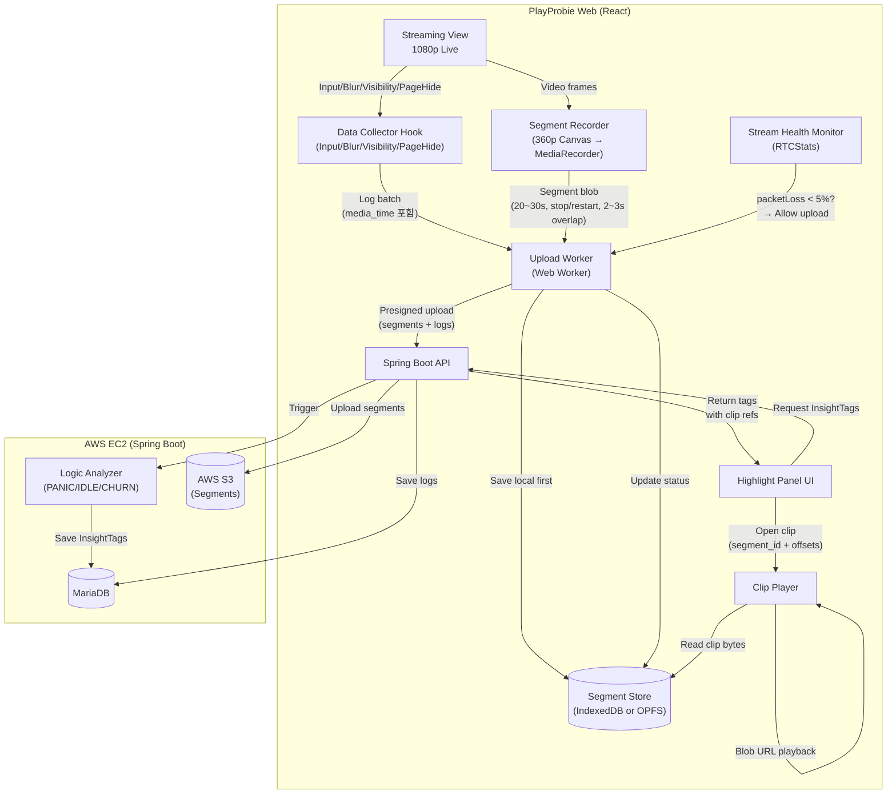
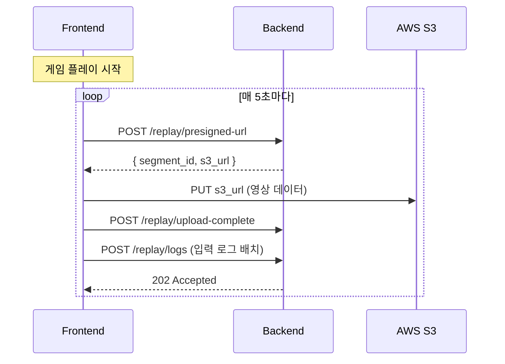
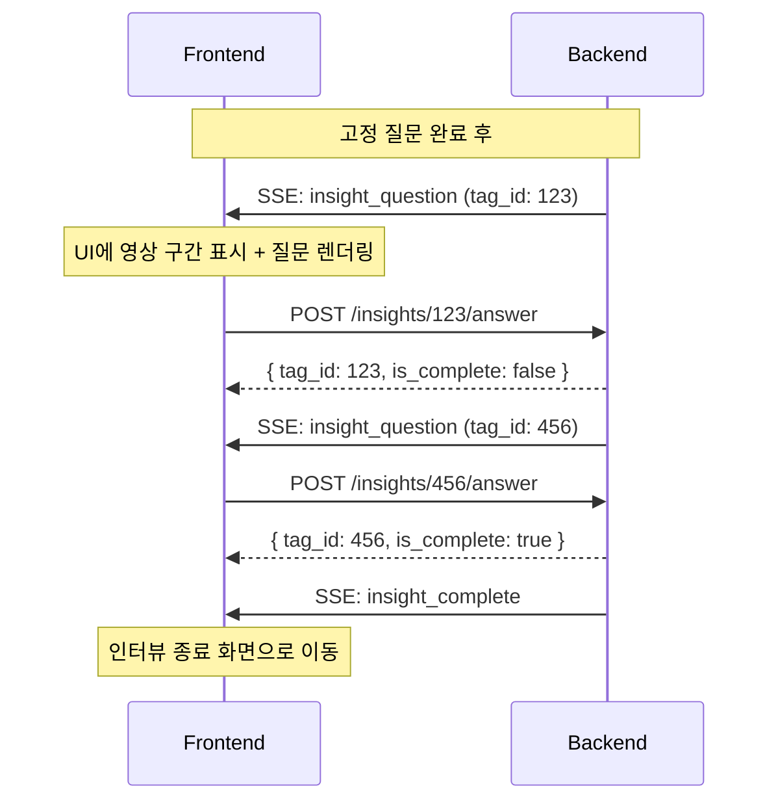

# Virtual Highlight 시스템 설계

영상 데이터와 입력 로그 동기화를 통한 하이라이트 클립 시스템입니다.

---

## 1. 핵심 컨셉 및 챌린지

GameLift Streams(WebRTC)는 **과거 구간 탐색(Seek/DVR)**이 불가능하며, 네트워크
대역폭에 민감합니다. 따라서, 스트리밍을 방해하지 않으면서 "증거 영상"을 확보하기
위해 **Virtual Highlight** 전략을 사용합니다.

### 해결 전략

| 챌린지               | 해결책 (Virtual Highlight)                                                                  |
| -------------------- | ------------------------------------------------------------------------------------------- |
| **WebRTC Seek 불가** | **별도 360p 세그먼트 녹화**: 라이브는 1080p로 보고, 증거용으로 360p 영상을 로컬에 몰래 녹화 |
| **네트워크 간섭**    | **Opportunistic Upload**: 스트리밍 중에는 업로드 중단, 안정적일 때만 전송                   |
| **브라우저 호환성**  | **Canvas 파이프라인**: `video` → `canvas(360p)` → `MediaRecorder` (Safari 호환)             |

---

## 2. MVP 스코프

- **필수**: 입력 로그 수집, 360p 세그먼트 녹화(IndexedDB/OPFS), Opportunistic
  Upload, InsightTag 생성.
- **후순위**: 오디오 녹음, SHA256 무결성 검증, 서버 트랜스코딩.

---

## 3. 시스템 아키텍처

### 전체 아키텍처



### 클라이언트 구성요소 (스레드 분리)

| 모듈                 | 스레드             | 역할                                                      |
| -------------------- | ------------------ | --------------------------------------------------------- |
| `SegmentRecorder`    | Main               | `video` → `canvas` 다운스케일 → `blob` 생성               |
| `SegmentStore`       | **Worker**         | 생성된 Blob을 OPFS(Origin Private File System)에 저장     |
| `UploadWorker`       | **Worker**         | 스트리밍 상태(`RTCStats`) 감시 및 백그라운드 업로드       |
| `UploadSW`           | **Service Worker** | 탭 종료 후에도 업로드 지속 (Chrome/Edge, Background Sync) |
| `UploadSharedWorker` | **Shared Worker**  | 탭 종료 후에도 업로드 지속 (Safari/Firefox, 다른 탭 필요) |
| `InputLogStore`      | Main + IndexedDB   | 입력 로그 실시간 저장 (탭 종료 시에도 보존)               |

---

## 4. 데이터 동기화 (Sync Contract)

입력 로그와 영상이 1프레임 단위로 맞아야 분석 신뢰도가 확보됩니다.

### 동기화 전략 (30초 청크 + 양쪽 3초 오버랩)

모든 데이터는 **영상 시간(`media_time`)**을 기준으로 정렬된 **청크(Chunk)**
단위로 관리됩니다. 각 세그먼트는 **30초** 단위로 분할되며, **양쪽 3초씩
오버랩**하여 총 **36초**가 녹화됩니다.

```
┌─────────────────────────────────────────────────────────────┐
│          Chunk (Core: 30s, Total Recording: 36s)            │
├─────────────────────────────────────────────────────────────┤
│ Chunk Meta: { segment_id: "uuid", range: [0, 30000] } (ms)  │
├─────────────────────────────────────────────────────────────┤
│ Segment (Video Blob)                                        │
│  - 360p, WebM/MP4                                           │
│  - Overlap: 3s on BOTH sides (양쪽 오버랩)                   │
│  - 실제 녹화: [-3s ~ +33s] 범위 (36초)                       │
├─────────────────────────────────────────────────────────────┤
│ Input Logs (Array)  ※ 시간 단위: ms (밀리초, 정수)          │
│  - { type: "KEY_DOWN", media_time: 12340, code: "Space" }   │
│  - { type: "MOUSE_MOVE", media_time: 12350, x: 100, y: 200 }│
└─────────────────────────────────────────────────────────────┘
```

### 데이터 명세

**1) 이벤트 로그 필드**

- `media_time`: 영상 기준 시간, **밀리초(ms) 정수**. **(Core Key)**
  - `video.currentTime * 1000` 또는 rVFC `mediaTime * 1000`.
- `client_ts`: 로컬 에포크 타임, **밀리초(ms) 정수** (디버깅용).
- `segment_id`: 해당 이벤트가 포함된 세그먼트 ID.

**2) 세그먼트 메타데이터**

- `start_media_time` / `end_media_time`: 영상 내 절대 시간 범위, **밀리초(ms)
  정수**.
- `upload_status`: `LOCAL_ONLY` → `UPLOADING` → `UPLOADED`.
- `overlap_ms`: **3000ms (양쪽 오버랩)**. 총 녹화 시간 = 코어 30000ms + 오버랩
  6000ms = 36000ms.

---

## 5. FE 기술적 챌린지 구현 상세 (현행 코드 기준)

> 아래 내용은 실제 구현 코드를 기준으로 정리합니다.

### 5.1 GLS 스트리밍 영향 최소화 업로드 (Opportunistic + Throttling)

- **업로드 파이프라인**: `SegmentRecorder` → `SegmentStore` →
  `useUploadWorker(Web Worker)` → `POST presigned-url` → `S3 PUT` →
  `POST upload-complete` → `POST logs`.
- **스트림 상태 게이팅**: `useStreamHealth`가 video/input `RTCStats`를 병합해
  `packetLoss`/`RTT`를 평가하며, 지표 누락도 **UNSTABLE**로 간주해 업로드 중단.
- **업로드 속도 계산**:
  - `availableIncomingBitrate * 1%` (`UPLOAD_RATE_RATIO=0.01`)
  - 상한 `128kbps` (`UPLOAD_RATE_CAP_BPS`)
  - 지표 미수신 시 `64kbps` fallback (`UPLOAD_RATE_FALLBACK_BPS`)
  - `UNSTABLE` 전환 시 **0bps**로 강제
- **토큰 버킷 쓰로틀**: Worker에서 `Blob.stream()`을 `ReadableStream`으로 감싸
  bytes/sec를 제한. `UNSTABLE` 전환 시 `AbortController`로 업로드 즉시 중단.
- **큐/재시도**: 단일 업로드(직렬) + 지수 백오프(1s → 2s → 4s, 최대 3회).
- **백그라운드 지속**:
  - pending 업로드는 IndexedDB(`upload-sync-store`)에 `pending/processing`으로 저장.
  - `pagehide` 시 Service Worker(Chrome/Edge) 또는 Shared Worker(Safari/Firefox)가
    OPFS에서 Blob을 읽어 업로드를 이어감.
- **스트리밍 종료 후 처리**: `streamingActive=false`로 전환 시
  **업로드 제한을 해제**하여 잔여 세그먼트를 후처리.

### 5.2 저장 영상 + 키보드/마우스 로그 동기화

- **media_time 기준 통일**:
  - `requestVideoFrameCallback`(rVFC) 우선 사용.
  - 미지원 시 `video.currentTime`을 **16ms 폴링**하여 근사.
  - 모든 시간은 `Math.round(x * 1000)`으로 **ms 정수**로 고정.
- **세그먼트 타이밍(오버랩)**:
  - 코어 30s + 오버랩 3s.
  - **첫 세그먼트만 앞 오버랩 없이 33s**(0~33s), 이후 세그먼트는 36s 기록.
  - 다음 세그먼트 시작은 **첫 세그먼트 27s 이후**, 그다음은 30s 간격.
  - `getActiveSegmentIds(mediaTimeMs)`는 **recordStart~recordEnd(오버랩 포함)** 기준.
- **세그먼트 ID 매핑**:
  - `createSegmentInfoResolver`가 활성 세그먼트 중 **가장 최신 ID를 primary**로 선택.
  - 오버랩 구간은 `segment_ids` 배열로 **다중 귀속**.
  - 세그먼트 녹화 비활성 시 `seg_${sessionId}_${Date.now()}`로 fallback.
- **입력 로그 스키마/샘플링**:
  - 키보드: `code`만 기록하고 `key`는 **빈 문자열**로 저장(민감정보 보호).
  - 마우스 이동: **15Hz + 5px 이동 임계값** 샘플링.
  - 휠: **30Hz 샘플링**, 게임패드: 축 변화량 **0.1 임계값**.
  - `BLUR/FOCUS/VISIBILITY/PAGE_HIDE` 이벤트 포함.
- **저장/복제 정책**:
  - 메모리 Map + IndexedDB(`input-log-store`)에 **실시간 이중 저장**.
  - 오버랩 구간 로그는 `segment_ids` 기준으로 **세그먼트별 복제 저장**.
  - 세그먼트 저장 시 `drainLogsBySegment`로 해당 구간 로그를 묶어 업로드 큐에 전달.
- **리플레이 오프셋 보정**:
  - `ReplayOverlay`는 `segment.start_media_time - overlap_ms`를 기준점으로 잡아
    `video_start_ms`/`video_end_ms`를 **세그먼트 내부 오프셋으로 변환**해 반복 재생.

---

## 6. Server Developer Agreement (Smart Replay & Insight)

서버 개발자와 합의된 기능 연동 가이드입니다.

### 📋 개요

플레이어의 게임 입력 로그를 분석하여 특이 행동(Panic, Idle)을 감지하고, 이에
대한 질문을 SSE로 스트리밍하는 기능입니다.

---

### 📡 REST API 명세

#### 1. 입력 로그 전송

게임 플레이 중 입력 로그를 배치로 전송합니다.

```
POST /sessions/{sessionId}/replay/logs
Content-Type: application/json
```

**Request Body:**

```json
{
  "session_id": "550e8400-e29b-41d4-a716-446655440000",
  "segment_id": "seg_abc123",
  "video_url": "https://s3.ap-northeast-2.amazonaws.com/...",
  "logs": [
    {
      "type": "KEY_DOWN",
      "media_time": 1500,
      "timestamp": 1705395600000,
      "code": "Space",
      "key": " "
    },
    {
      "type": "MOUSE_DOWN",
      "media_time": 2000,
      "timestamp": 1705395600500,
      "button": 0,
      "x": 450,
      "y": 320
    }
  ]
}
```

**Response:** `202 Accepted` (No Body)

---

#### 2. Presigned URL 발급

영상 세그먼트 업로드를 위한 S3 Presigned URL을 발급받습니다.

```
POST /sessions/{sessionId}/replay/presigned-url
Content-Type: application/json
```

**Request Body:**

```json
{
  "sequence": 0,
  "video_start_ms": 0,
  "video_end_ms": 30000,
  "content_type": "video/webm"
}
```

**Response:** `201 Created`

```json
{
  "result": {
    "segment_id": "550e8400-e29b-41d4-a716-446655440001",
    "s3_url": "https://dev-playprobie-replay.s3.ap-northeast-2.amazonaws.com/replays/...",
    "expires_in": 300
  }
}
```

> ⚠️ s3_url은 PUT 전용입니다. 영상 업로드 시 PUT 요청을 사용하세요.

---

#### 3. 업로드 완료 알림

S3 업로드 완료 후 서버에 알립니다.

```
POST /sessions/{sessionId}/replay/upload-complete
Content-Type: application/json
```

**Request Body:**

```json
{
  "segment_id": "550e8400-e29b-41d4-a716-446655440001"
}
```

**Response:** `200 OK` (No Body)

---

#### 4. 인사이트 질문 답변

SSE로 수신한 인사이트 질문에 대한 답변을 전송합니다.

```
POST /sessions/{sessionId}/replay/insights/{tagId}/answer
Content-Type: application/json
```

**Request Body:**

```json
{
  "answer_text": "네, 그 부분에서 어떤 버튼을 눌러야 할지 몰라서 당황했어요."
}
```

**Response:** `200 OK`

```json
{
  "result": {
    "tag_id": 123,
    "is_complete": false
  }
}
```

| 필드          | 타입    | 설명                                                 |
| ------------- | ------- | ---------------------------------------------------- |
| `tag_id`      | Long    | 답변한 질문 ID                                       |
| `is_complete` | Boolean | `true`: 모든 인사이트 질문 완료 / `false`: 추가 질문 |

> 📌 다음 질문은 SSE `insight_question` 이벤트로 전송됩니다.

---

### 📺 SSE 이벤트 명세

기존 SSE 연결(`/sessions/{sessionId}/sse`)을 통해 인사이트 관련 이벤트가
전송됩니다.

#### 1. `insight_question` - 인사이트 질문

```json
{
  "tag_id": 123,
  "insight_type": "PANIC",
  "video_start_ms": 45000,
  "video_end_ms": 48000,
  "question_text": "영상의 45초~48초 구간에서 버튼을 빠르게 여러 번 누르셨는데, 혹시 당황하셨거나 조작이 어려우셨나요?",
  "turn_num": 1,
  "remaining_insights": 1
}
```

| 필드                 | 타입    | 설명                           |
| -------------------- | ------- | ------------------------------ |
| `tag_id`             | Long    | **답변 API 호출 시 필요한 ID** |
| `insight_type`       | Enum    | `PANIC` / `IDLE`               |
| `video_start_ms`     | Long    | 영상 구간 시작 (ms)            |
| `video_end_ms`       | Long    | 영상 구간 끝 (ms)              |
| `question_text`      | String  | 질문 텍스트                    |
| `turn_num`           | Integer | 현재 질문 번호 (1부터 시작)    |
| `remaining_insights` | Integer | 남은 질문 수                   |

#### 2. `insight_complete` - 인사이트 Phase 완료

```json
{
  "total_insights": 2,
  "answered": 2
}
```

| 필드             | 타입    | 설명                    |
| ---------------- | ------- | ----------------------- |
| `total_insights` | Integer | 전체 인사이트 수        |
| `answered`       | Integer | 답변 완료된 인사이트 수 |

---

### 🎬 연동 시나리오

#### 시나리오 1: 게임 플레이 중 로그 수집



#### 시나리오 2: 인사이트 질문 Phase



---

### ⚠️ 주의 사항

1. **SSE 연결 유지**: 인사이트 질문은 SSE로만 전송되므로 연결 유지 필수
2. **tag_id 보관**: 답변 API 호출 시 SSE로 수신한 `tag_id` 필요
3. **is_complete 확인**: REST 응답의 `is_complete`가 `true`여도
   `insight_complete` SSE 이벤트를 대기
4. **영상 구간**: `video_start_ms` ~ `video_end_ms` 구간을 UI에서 하이라이트
   권장

---

### 📊 InsightType 설명

| Type    | 설명             | 감지 조건                      |
| ------- | ---------------- | ------------------------------ |
| `PANIC` | 당황/급박한 상황 | 0.5초 내 동일 키 5회 이상 연타 |
| `IDLE`  | 멈춤/고민 상황   | 10초 이상 입력 없음            |
