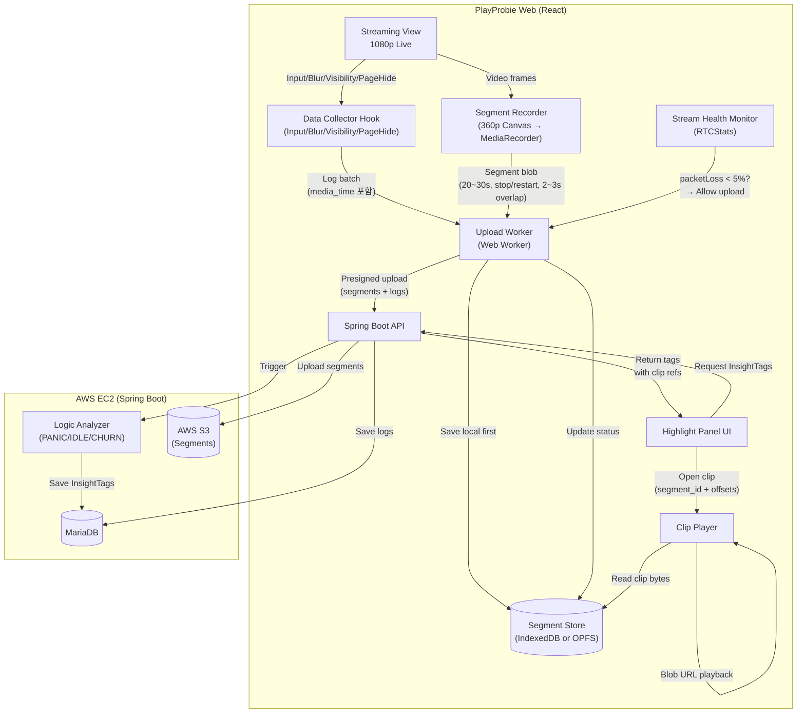

# Virtual Highlight 시스템 설계

영상 데이터와 입력 로그 동기화를 통한 하이라이트 클립 시스템입니다.

---

## 1. 핵심 컨셉 및 챌린지

GameLift Streams(WebRTC)는 **과거 구간 탐색(Seek/DVR)**이 불가능하며, 네트워크
대역폭에 민감합니다. 따라서, 스트리밍을 방해하지 않으면서 "증거 영상"을 확보하기
위해 **Virtual Highlight** 전략을 사용합니다.

### 해결 전략

| 챌린지               | 해결책 (Virtual Highlight)                                                                  |
| -------------------- | ------------------------------------------------------------------------------------------- |
| **WebRTC Seek 불가** | **별도 360p 세그먼트 녹화**: 라이브는 1080p로 보고, 증거용으로 360p 영상을 로컬에 몰래 녹화 |
| **네트워크 간섭**    | **Opportunistic Upload**: 스트리밍 중에는 업로드 중단, 안정적일 때만 전송                   |
| **브라우저 호환성**  | **Canvas 파이프라인**: `video` → `canvas(360p)` → `MediaRecorder` (Safari 호환)             |

---

## 2. MVP 스코프

- **필수**: 입력 로그 수집, 360p 세그먼트 녹화(IndexedDB/OPFS), Opportunistic
  Upload, InsightTag 생성.
- **후순위**: 오디오 녹음, SHA256 무결성 검증, 서버 트랜스코딩.

---

## 3. 시스템 아키텍처

### 전체 아키텍처



### 클라이언트 구성요소 (스레드 분리)

| 모듈              | 스레드     | 역할                                                  |
| ----------------- | ---------- | ----------------------------------------------------- |
| `SegmentRecorder` | Main       | `video` → `canvas` 다운스케일 → `blob` 생성           |
| `SegmentStore`    | **Worker** | 생성된 Blob을 OPFS(Origin Private File System)에 저장 |
| `UploadWorker`    | **Worker** | 스트리밍 상태(`RTCStats`) 감시 및 백그라운드 업로드   |

---

## 4. 데이터 동기화 (Sync Contract)

입력 로그와 영상이 1프레임 단위로 맞아야 분석 신뢰도가 확보됩니다.

### 동기화 전략 (30초 청크 + 양쪽 3초 오버랩)

모든 데이터는 **영상 시간(`media_time`)**을 기준으로 정렬된 **청크(Chunk)**
단위로 관리됩니다. 각 세그먼트는 **30초** 단위로 분할되며, **양쪽 3초씩
오버랩**하여 총 **36초**가 녹화됩니다.

```
┌─────────────────────────────────────────────────────────────┐
│          Chunk (Core: 30s, Total Recording: 36s)            │
├─────────────────────────────────────────────────────────────┤
│ Chunk Meta: { segment_id: "uuid", range: [0.0, 30.0] }      │
├─────────────────────────────────────────────────────────────┤
│ Segment (Video Blob)                                        │
│  - 360p, WebM/MP4                                           │
│  - Overlap: 3s on BOTH sides (양쪽 오버랩)                   │
│  - 실제 녹화: [-3s ~ +33s] 범위 (36초)                       │
├─────────────────────────────────────────────────────────────┤
│ Input Logs (Array)                                          │
│  - { type: "KEY_DOWN", media_time: 12.34, code: "Space" }   │
│  - { type: "MOUSE_MOVE", media_time: 12.35, x: 100, y: 200 }│
└─────────────────────────────────────────────────────────────┘
```

### 데이터 명세

**1) 이벤트 로그 필드**

- `media_time`: 영상 기준 시간 (`video.currentTime` 또는 rVFC). **(Core Key)**
- `client_ts`: 로컬 에포크 타임 (디버깅용).
- `segment_id`: 해당 이벤트가 포함된 세그먼트 ID.

**2) 세그먼트 메타데이터**

- `start_media_time` / `end_media_time`: 영상 내 절대 시간 범위 (코어 30초).
- `upload_status`: `LOCAL_ONLY` → `UPLOADING` → `UPLOADED`.
- `overlap_sec`: **3초 (양쪽 오버랩)**. 총 녹화 시간 = 코어 30초 + 오버랩 6초 =
  36초.

---

## 5. 분석 및 결과물 (InsightTag)

서버는 업로드된 로그와 세그먼트를 분석하여 **InsightTag**를 생성합니다. UI는
이를 통해 하이라이트 구간을 즉시 재생할 수 있습니다.

### 감지 룰 (Trigger)

| Tag Type  | 조건 (Trigger)                                  | 하이라이트 범위                       |
| --------- | ----------------------------------------------- | ------------------------------------- |
| **PANIC** | 1초 내 동일 입력 5회 이상                       | 전후 5초 (총 10초)                    |
| **IDLE**  | 10초 이상 입력 없음                             | 마지막 입력 -2초 ~ 재입력 (최대 30초) |
| **CHURN** | 윈도우 포커스 이탈 (`blur`, `visibilitychange`) | 이탈 직전 10초                        |

### InsightTag 스키마 (Result)

분석 결과는 JSON 형태로 저장되며, 클라이언트는 `clips` 배열을 통해 즉시 재생을
수행합니다.

```json
{
  "session_id": "sess_8829",
  "tag_type": "PANIC",
  "score": 0.95,
  "description": "Space Bar 연타 감지 (8회/sec)",

  // 분석된 발생 시간 (영상 기준)
  "media_time_start": 120.5,
  "media_time_end": 130.5,

  // 재생을 위한 세그먼트 매핑 정보 (서버가 계산해서 내려줌)
  "clips": [
    {
      "segment_id": "seg_a1b2", // 120초~150초를 담고 있는 파일
      "offset_start": 0.5, // 파일 시작점으로부터 0.5초 지점
      "offset_end": 10.5, // 파일 시작점으로부터 10.5초 지점
      "video_url": "https://s3.../seg_a1b2.webm" // (업로드 완료 시)
    }
  ],

  // 재생 가능 상태
  "playback_status": "READY_LOCAL" // or READY_CLOUD, UPLOADING, UNAVAILABLE
}
```

---

## 6. Opportunistic Upload 전략

스트리밍 품질 보호를 위해 무조건적인 실시간 업로드를 지양합니다.

### 상태 판단 (SDK 활용)

GameLift Streams Web SDK의 API를 사용하여 네트워크 상태를 객관적으로 판단합니다.

```typescript
const stats = await gameLiftClient.getVideoRTCStats();
// Packet Loss > 5% 또는 RTT > 200ms 면 업로드 일시 중단
if (isNetworkUnstable(stats)) {
  uploadWorker.pause();
} else {
  uploadWorker.resume();
}
```

---

## 7. 구현 로드맵

1.  **Phase 1 (녹화 & 저장)**: Canvas 캡처, MediaRecorder 구현, IndexedDB/OPFS
    저장 로직.
2.  **Phase 2 (업로드)**: Upload Worker, S3 Presigned URL 연동, Backoff/Resume
    로직.
3.  **Phase 3 (분석)**: 서버 로그 분석 파이프라인, InsightTag 생성 로직.
4.  **Phase 4 (재생)**: Virtual Highlight Player (Local Blob 우선 재생 → S3 URL
    Fallback).
