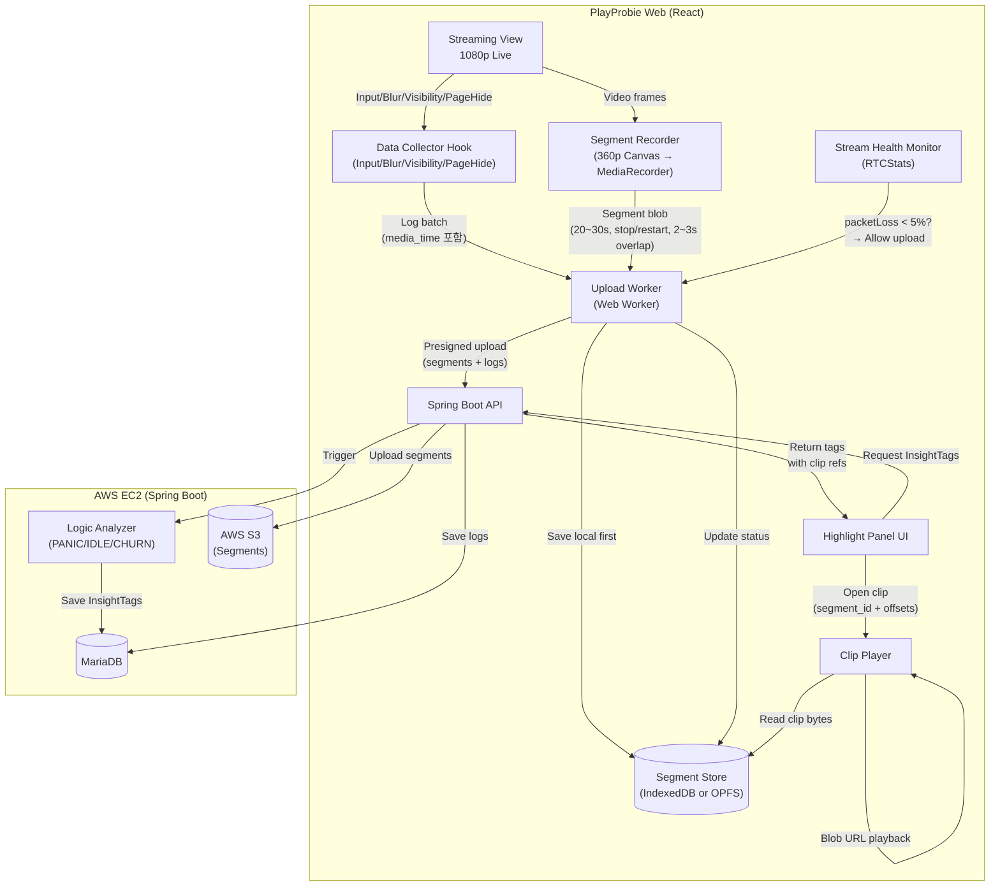

# Virtual Highlight 시스템 설계

영상 데이터와 입력 로그 동기화를 통한 하이라이트 클립 시스템입니다.

---

## 1. 핵심 컨셉 및 챌린지

GameLift Streams(WebRTC)는 **과거 구간 탐색(Seek/DVR)**이 불가능하며, 네트워크
대역폭에 민감합니다. 따라서, 스트리밍을 방해하지 않으면서 "증거 영상"을 확보하기
위해 **Virtual Highlight** 전략을 사용합니다.

### 해결 전략

| 챌린지               | 해결책 (Virtual Highlight)                                                                  |
| -------------------- | ------------------------------------------------------------------------------------------- |
| **WebRTC Seek 불가** | **별도 360p 세그먼트 녹화**: 라이브는 1080p로 보고, 증거용으로 360p 영상을 로컬에 몰래 녹화 |
| **네트워크 간섭**    | **Opportunistic Upload**: 스트리밍 중에는 업로드 중단, 안정적일 때만 전송                   |
| **브라우저 호환성**  | **Canvas 파이프라인**: `video` → `canvas(360p)` → `MediaRecorder` (Safari 호환)             |

---

## 2. MVP 스코프

- **필수**: 입력 로그 수집, 360p 세그먼트 녹화(IndexedDB/OPFS), Opportunistic
  Upload, InsightTag 생성.
- **후순위**: 오디오 녹음, SHA256 무결성 검증, 서버 트랜스코딩.

---

## 3. 시스템 아키텍처

### 전체 아키텍처



### 클라이언트 구성요소 (스레드 분리)

| 모듈              | 스레드     | 역할                                                  |
| ----------------- | ---------- | ----------------------------------------------------- |
| `SegmentRecorder` | Main       | `video` → `canvas` 다운스케일 → `blob` 생성           |
| `SegmentStore`    | **Worker** | 생성된 Blob을 OPFS(Origin Private File System)에 저장 |
| `UploadWorker`    | **Worker** | 스트리밍 상태(`RTCStats`) 감시 및 백그라운드 업로드   |

---

## 4. 데이터 동기화 (Sync Contract)

입력 로그와 영상이 1프레임 단위로 맞아야 분석 신뢰도가 확보됩니다.

### 동기화 전략 (30초 청크 + 양쪽 3초 오버랩)

모든 데이터는 **영상 시간(`media_time`)**을 기준으로 정렬된 **청크(Chunk)**
단위로 관리됩니다. 각 세그먼트는 **30초** 단위로 분할되며, **양쪽 3초씩
오버랩**하여 총 **36초**가 녹화됩니다.

```
┌─────────────────────────────────────────────────────────────┐
│          Chunk (Core: 30s, Total Recording: 36s)            │
├─────────────────────────────────────────────────────────────┤
│ Chunk Meta: { segment_id: "uuid", range: [0, 30000] } (ms)  │
├─────────────────────────────────────────────────────────────┤
│ Segment (Video Blob)                                        │
│  - 360p, WebM/MP4                                           │
│  - Overlap: 3s on BOTH sides (양쪽 오버랩)                   │
│  - 실제 녹화: [-3s ~ +33s] 범위 (36초)                       │
├─────────────────────────────────────────────────────────────┤
│ Input Logs (Array)  ※ 시간 단위: ms (밀리초, 정수)          │
│  - { type: "KEY_DOWN", media_time: 12340, code: "Space" }   │
│  - { type: "MOUSE_MOVE", media_time: 12350, x: 100, y: 200 }│
└─────────────────────────────────────────────────────────────┘
```

### 데이터 명세

**1) 이벤트 로그 필드**

- `media_time`: 영상 기준 시간, **밀리초(ms) 정수**. **(Core Key)**
  - `video.currentTime * 1000` 또는 rVFC `mediaTime * 1000`.
- `client_ts`: 로컬 에포크 타임, **밀리초(ms) 정수** (디버깅용).
- `segment_id`: 해당 이벤트가 포함된 세그먼트 ID.

**2) 세그먼트 메타데이터**

- `start_media_time` / `end_media_time`: 영상 내 절대 시간 범위, **밀리초(ms)
  정수**.
- `upload_status`: `LOCAL_ONLY` → `UPLOADING` → `UPLOADED`.
- `overlap_ms`: **3000ms (양쪽 오버랩)**. 총 녹화 시간 = 코어 30000ms + 오버랩
  6000ms = 36000ms.

---

## 5. Server Developer Agreement (Smart Replay & Insight)

서버 개발자와 합의된 기능 연동 가이드입니다.

### 📋 개요

유저의 게임 플레이 중 입력 패턴(키보드/마우스)과 **플레이 영상**을 수집하여
서버로 전송하고, 인터뷰 단계에서 특이 행동(광클, 멍때림 등)이 감지되면 **AI가
해당 구간을 다시 보여주며 질문**하는 기능을 구현합니다.

### 🔄 전체 흐름 (User Flow)

1. **게임 플레이 중 (Background)**
   - 30초 단위로 영상을 청킹(Chunking)하여 S3에 업로드.
   - 유저의 키보드/마우스 입력 로그를 수집하여 주기적으로 서버 전송.
2. **인터뷰 진행 (Chat UI)**
   - 기존 고정 질문(Fixed Question) 진행.
3. **인사이트 질문 (New Phase)**
   - 고정 질문 완료 후, 서버 분석 결과에 따라 **'인사이트 질문'**이 도착.
   - 채팅창에 **[🎥 장면 다시보기]** 버튼이 노출됨.
   - 버튼 클릭 시, 게임 플레이어가 해당 시점(`video_start_ms`)으로 이동하여
     재생.

### 📡 API Specification

#### A. 영상 업로드 (Play Phase)

**순서:** `Presigned URL 발급` → `S3 Upload (PUT)` → `업로드 완료 알림`

**1) Presigned URL 발급 요청**

- **URL:** `POST /sessions/{sessionId}/replay/presigned-url`
- **Body:**
  ```json
  {
    "sequence": 0, // 세그먼트 순서 (0부터 시작)
    "video_start_ms": 0, // 해당 청크의 시작 시간 (video.currentTime 기준)
    "video_end_ms": 30000, // 해당 청크의 종료 시간
    "content_type": "video/webm"
  }
  ```
- **Response:**
  ```json
  {
    "segment_id": "seg_a1b2...",
    "s3_url": "https://s3.amazonaws.com/...",
    "expires_in": 300
  }
  ```

**2) 업로드 완료 알림**

- **URL:** `POST /sessions/{sessionId}/replay/upload-complete`
- **Body:**
  ```json
  {
    "segment_id": "seg_a1b2..."
  }
  ```

#### B. 입력 로그 전송

**URL:** `POST /sessions/{sessionId}/replay/logs`

- **Body:**
  ```json
  {
    "session_id": "sess_8829",
    "segment_id": "seg_a1b2",
    "s3_url": "...", // (선택) 매핑 검증용
    "logs": [
      {
        "type": "KEY_DOWN", // KEY_DOWN, KEY_UP, MOUSE_DOWN 등
        "media_time": 120125, // [중요] video.currentTime (ms 단위)
        "client_ts": 1736942000, // Date.now()
        "code": "Space",
        "key": " "
      }
    ]
  }
  ```

#### C. 인터뷰 및 재생 (Interview Phase)

**1) SSE 이벤트: `insight_question`**

- **Data:**
  ```json
  {
    "insight_type": "PANIC", // PANIC(광클), IDLE(멍때림), CHURN(이탈)
    "video_start_ms": 45200, // [Seek Point] 재생 시작 지점
    "video_end_ms": 48500, // 재생 종료 지점 (UI 표시용)
    "question_text": "45초 구간에서 버튼을 빠르게 누르셨는데, 당황하셨나요?",
    "turn_num": 1,
    "remaining_insights": 1
  }
  ```

**2) 답변 전송**

- **URL:** `POST /interview/{sessionUuid}/messages`
- **Body:**
  ```json
  {
    "q_type": "INSIGHT",
    "insight_type": "PANIC",
    "turn_num": 1,
    "answer_text": "네, 너무 어려웠어요."
  }
  ```
