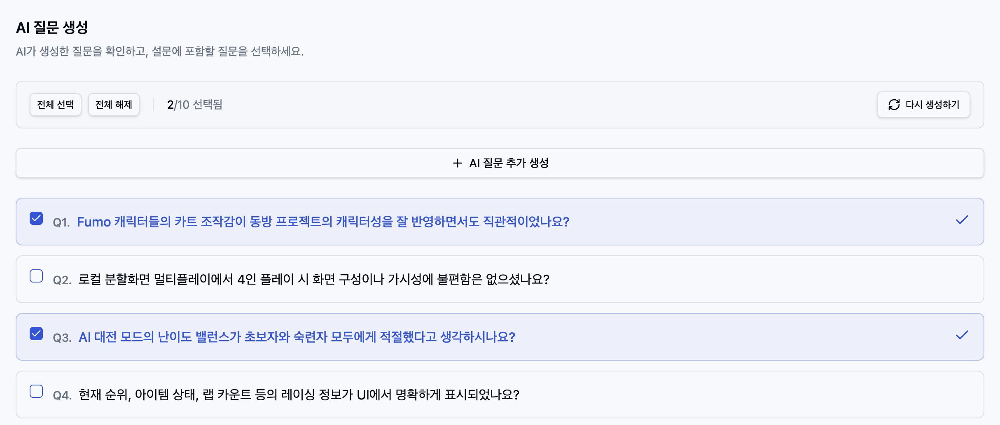
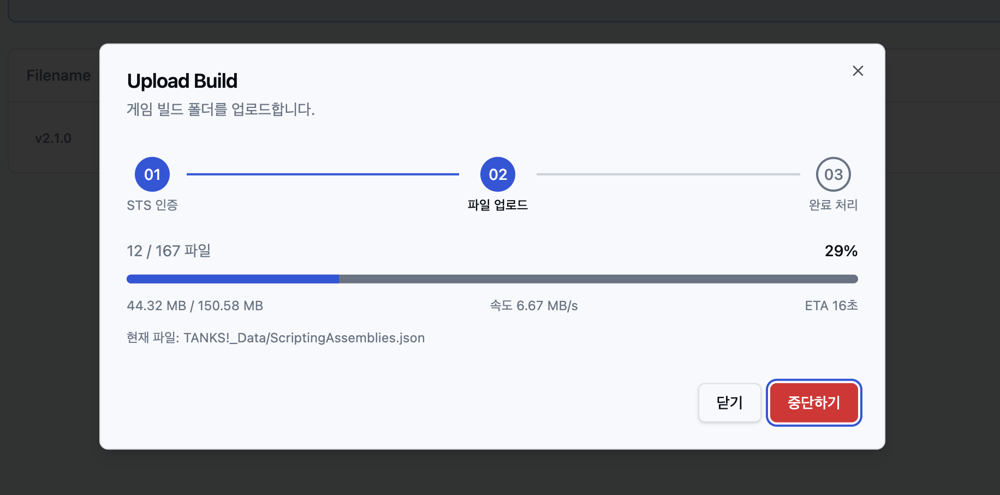
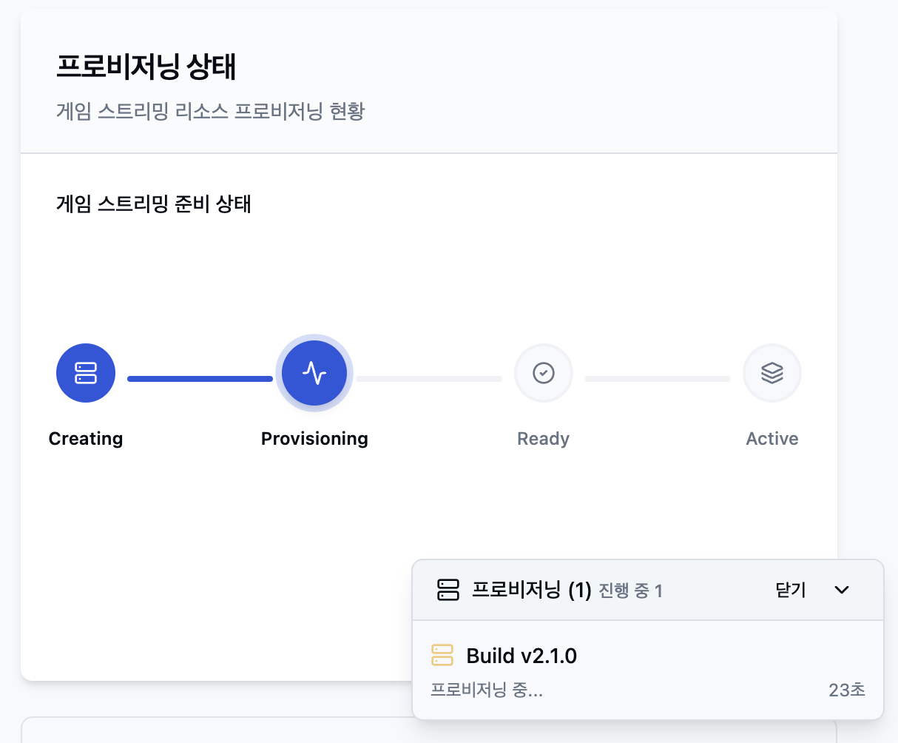
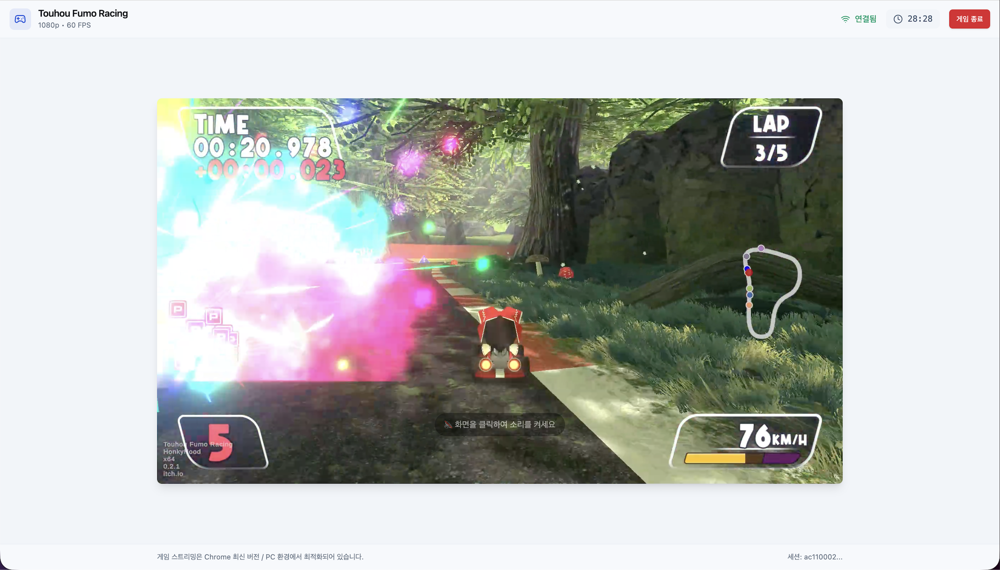
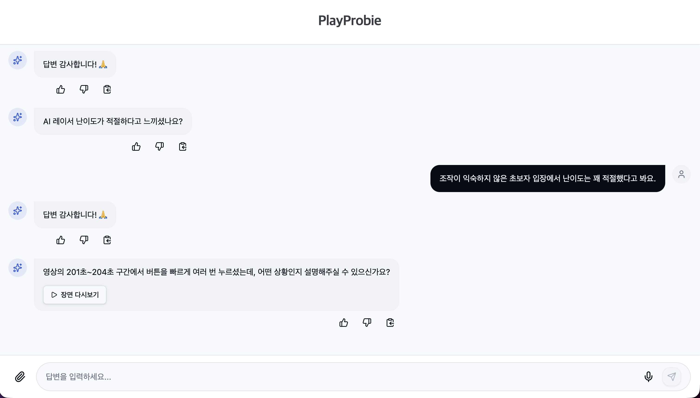
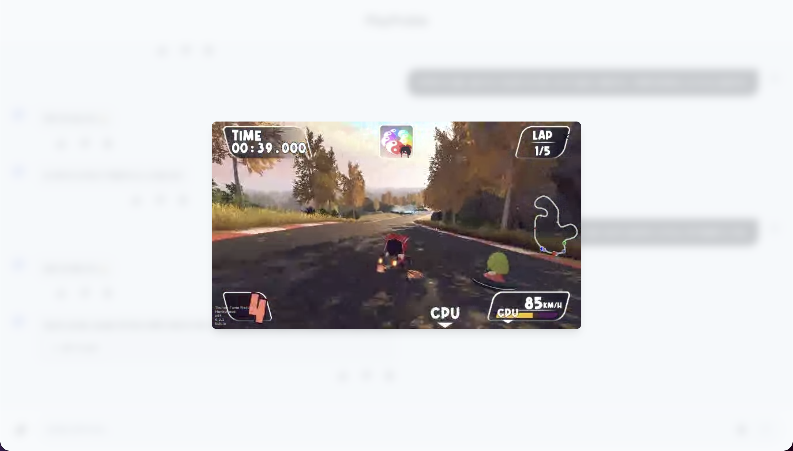
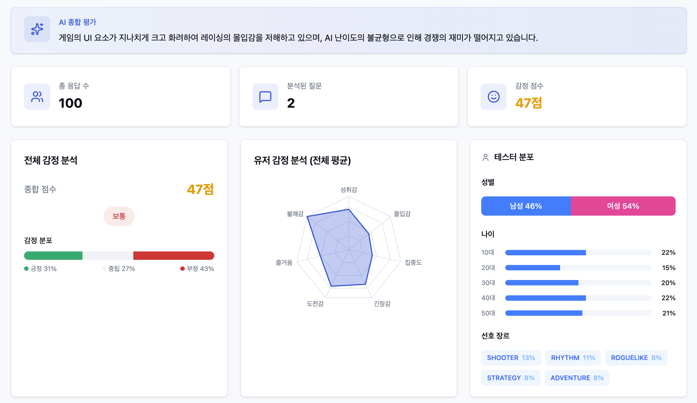

# PLAY PROBIE

<div align="center">

> **게임 테스터의 진짜 속마음을 이끌어내는 플레이 테스트 솔루션**

<p>
  
  
  
  
</p>

</div>

## 🧭 목차

- [서비스 소개](#-서비스-소개)
- [핵심 기능](#-핵심-기능)
- [기술적 챌린지](#-기술적-챌린지)
- [아키텍처](#-아키텍처)
- [빠른 시작](#-빠른-시작)
- [문서](#-문서)

---

## 📖 서비스 소개

- **올인원 솔루션**: 플레이 테스트의 설계, 진행, 결과 분석까지 하나로 통합
- **AI 심층 인터뷰**: 유저의 생생한 피드백과 핵심 인사이트 제공을 위한 AI 기반
  인터뷰

### 서비스 활용 흐름

```mermaid
flowchart LR
    subgraph DEV["🎮 게임 개발사"]
        A[로그인] --> B[워크스페이스/게임 선택]
        B --> C[설문 생성]
        C --> D[빌드 업로드]
        D --> E[프로비저닝]
        E --> F[플레이 링크 공유]
    end

    subgraph TESTER["🕹️ 테스터"]
        G[링크 접속] --> H[접속 대기]
        H --> I[게임 플레이]
        I --> J[설문 페이지 이동]
        J --> K[AI 인터뷰 진행]
        K --> L[설문 완료]
    end

    subgraph ANALYSIS["📊 분석"]
        M[실시간 결과 확인] --> N[AI 분석 인사이트]
        N --> O[설문 종료]
    end

    F -.->|디스코드 공유| G
    L -.->|데이터 수집| M
```



**1️⃣ 게임 개발사 – 테스트 준비**

1. 로그인 후 워크스페이스 및 게임 선택
2. AI 기반으로 맞춤형 설문 생성
3. 게임 빌드 파일(exe) 업로드 및 클라우드 프로비저닝
4. 생성된 게임 플레이 링크를 커뮤니티에 공유

**2️⃣ 테스터 – 플레이 및 설문**

1. 공유된 링크 접속 (접속 대기열 지원)
2. 브라우저에서 **다운로드 없이** 클라우드 게임 스트리밍 플레이
3. 플레이 종료 후 설문 페이지 이동
4. **AI 인터뷰** 기반 심층 설문 진행

**3️⃣ 게임 개발사 – 분석 및 종료**

1. 실시간 대시보드에서 설문 결과 확인
2. 클러스터링된 피드백과 감정 분석 인사이트 활용

---

## ✨ 핵심 기능

### 1. AI 최적 맞춤 질문 생성

> **RAG 기반 게임 맞춤형 질문 생성**



- 테스터가 입력한 게임 정보로부터 핵심 메카닉 자동 추출
- 유저 입력 정보와 설문 목적 기반 질문 DB 검색 및 RAG 활용

### 2. 게임 빌드 파일 업로드 및 프로비저닝

<p align="left">
  
  
</p>

- 게임 빌드 파일(.exe) 업로드만으로 자동 클라우드 프로비저닝

### 3. 시공간 제약 없는 클라우드 게임 스트리밍

> **URL 하나로 OS, 사양 무관 브라우저 플레이**



- WebRTC 기반 저지연 게임 스트리밍
- 플레이 영상 자동 녹화 및 세그먼트 분할 저장 (영상-입력 로그 동기화)

### 4. 실시간 반응하는 AI 인터뷰

> **LangGraph 기반 심층 인터뷰**

<p align="left">
  
  
</p>

- 상태 머신 구조로 맥락에 맞는 유연한 대화 유도
- DICE 기반 프로빙으로 답변의 깊이 측정 및 추가 질문

### 5. 인사이트 대시보드

<p align="left">
  
  
</p>

- **HDBSCAN 클러스터링**: 유사 맥락 피드백 분류
- **다각도 분석**: 키워드 추출(c-TF-IDF), 감정 분석(GEQ), LLM 요약

---

## 🔧 기술적 챌린지

| 챌린지 주제                           | 문제 (Problem)                                              | 해결 (Solution)                                                                                                  | 효과 (Effect)                                                                      |
| :------------------------------------ | :---------------------------------------------------------- | :--------------------------------------------------------------------------------------------------------------- | :--------------------------------------------------------------------------------- |
| **스트리밍 방해 없는<br>영상 업로드** | 게임 플레이 중 업로드 트래픽 간섭으로<br>스트리밍 품질 저하 | • RTCStats 불안정 시 업로드 제한 (128kbps)<br>• Service/Shared Worker + IndexedDB/OPFS<br>활용 백그라운드 업로드 | • WebRTC 품질 유지<br>(jitter 10~15ms, 60FPS)<br>• 탭 종료 후에도 데이터 유실 방지 |
| **영상 클립 생성 및<br>재생 최적화**  | 인터뷰 재생 시<br>클립 로딩 4초 이상 소요                   | • 1080p → 360p 다운스케일 + MediaRecorder<br>• OPFS 저장 청크를 Blob URL로 프리로딩                              | • 로딩 시간 단축<br>(4초 → 0.5초)                                                  |
| **RAG 질문 생성<br>정밀화**           | 단순 벡터 검색으로<br>의미 중복 질문 반복                   | • 유사도(40%) + 목적(30%) + 채택률(30%)<br>• MMR 알고리즘으로 중복 필터링                                        | • 목적 적합성 30% 증가<br>• 상위 10개 질문 내 중복 0건                             |
| **밀도 기반<br>클러스터링 관리**      | K-Means의 강제 할당 및<br>클러스터 수 지정 필요             | • HDBSCAN 도입으로<br>클러스터 수 자동 결정 및 노이즈 분리                                                       | • 데이터 분포 정밀 포착<br>• 소수 의견도 인사이트화                                |
| **클러스터링<br>연산 가속**           | 고차원(1024) 임베딩 연산으로<br>서버 부하 및 변별력 저하    | • UMAP으로 차원 축소 (1024 → 5차원)                                                                              | • 연산량 약 1/200 감소<br>• 변별력 상승                                            |

---

## 🏗 아키텍처


---

## 🚀 빠른 시작

### 1) 요구 사항

- **Node.js**: >= 24.0.0 < 25.0.0

### 2) 설치 및 실행

```bash
# 의존성 설치
npm install

# 환경 변수 설정
cp .env.example .env.local

# 개발 서버 실행
npm run dev
```

### 3) 주요 명령어

| 명령어            | 설명                       |
| :---------------- | :------------------------- |
| `npm run dev`     | 개발 서버 실행 (기본)      |
| `npm run dev-msw` | Mock 서버(MSW) 모드로 실행 |
| `npm run build`   | 프로덕션 빌드              |
| `npm run lint`    | 린트 검사                  |
| `npm run test`    | 테스트 실행                |

---

## 📚 문서

- [**AGENTS.md**](./AGENTS.md): Codex Agent 문서
- [**GEMINI.md**](./GEMINI.md): Antigravity & Gemini Agent 문서
- [**.agent/instructions/**](./.agent/instructions/): Agent 지침
